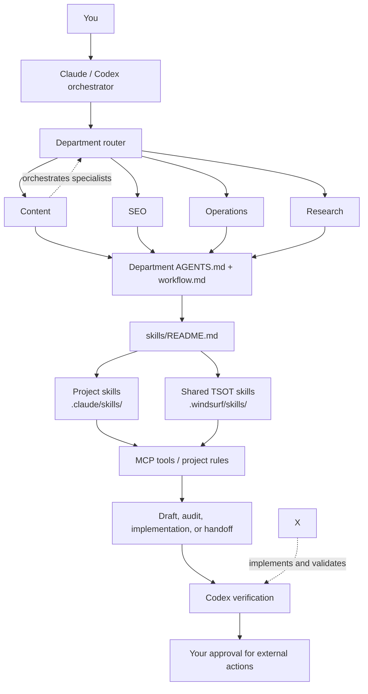
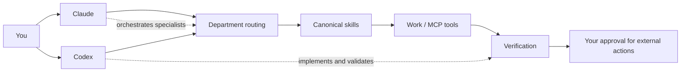

# Remy-Style Department Revamp Handoff

This document is the handoff reference for moving from the office PC to the home PC. It describes the completed Claude + Codex revamp and the operating model now layered over the shared TSOT foundation.

## Executive summary

The system was not replaced with a separate repository or a new agent platform. TSOT remains the shared canonical foundation for skills, rules, workflows, and compatibility paths. The revamp adds a Remy-style operating layer above it: departments route work, shared context explains responsibilities, skills act as standard operating procedures, MCP tools form the controlled work boundary, validators provide evidence, and the executive-assistant workspace provides memory and scheduled-work scaffolding.

Either Claude or Codex can be the starting point. There is no Claude-first requirement. The entrypoint coordinates the work, routes it to the appropriate department and bounded worker, and returns a verified result for the user’s approval where an external action is involved.

## The operating model





The first diagram is preserved exactly as the original reference, including its undefined `X` node. It is intentionally not normalized or repaired here.

## What changed from the old TSOT-only mental model

The old mental model treated TSOT as the main operating surface: find a shared rule or skill, then ask an agent to act. That foundation still exists. The new model makes the path explicit:

| Layer | Responsibility | Current implementation |
| --- | --- | --- |
| Shared foundation | Canonical rules, skills, workflows, and cross-project parity | TSOT, including shared `.windsurf/` compatibility paths |
| Department routing | Classify work and select operating context | `departments/content`, `departments/seo`, `departments/operations`, `departments/research` |
| Shared context | Explain the department’s scope, workflow, and handoff contract | Each department has `AGENTS.md`, `skills/README.md`, and `workflow.md` |
| SOP layer | Provide repeatable task recipes | `.claude/skills/` plus shared TSOT skills |
| Work boundary | Perform bounded repository or external-system work | MCP tools and project rules |
| Evidence gate | Check imports, content status, policy, and diffs | `scripts/verify-imports.py`, `scripts/verify-content-status.py`, `scripts/verify-orchestration-policy.py`, `git diff --check` |
| Memory and schedules | Preserve assistant context and define future recurring work | `workspaces/executive-assistant/` |

Departments are routing and operating contracts, not autonomous agents. The orchestrator identifies the department, loads its context, dispatches bounded work, integrates the result, and keeps final decisions with the user where approval is required.

## Files and paths now present

- `departments/README.md` — department routing and usage overview.
- `departments/content/` — content department context, workflow, and skill pointers.
- `departments/seo/` — SEO department context, workflow, and skill pointers.
- `departments/operations/` — operations department context, workflow, and skill pointers.
- `departments/research/` — research department context, workflow, and skill pointers.
- `workspaces/executive-assistant/AGENTS.md` — EA operating contract.
- `workspaces/executive-assistant/CLAUDE.md` — EA-specific loader/context.
- `workspaces/executive-assistant/memory.md` — persistent working memory surface.
- `workspaces/executive-assistant/integrations.md` — integration boundary and adapter status.
- `workspaces/executive-assistant/schedules.md` — scheduled-work definitions.
- `workspaces/executive-assistant/skills/` — daily brief, meeting prep, and referral triage SOPs.
- `docs/ai/orchestration-policy.md` — model roles, worker mappings, and fail-closed rules.
- `.claude/rules/orchestration-gate.md` — always-on Claude/Codex orchestration gate.
- `scripts/verify-orchestration-policy.py` — static policy and pointer verification.
- `AGENTS.md` — project-level orchestration gate and operating references.

The protected AGENTS doctrine tables were not changed: File Architecture, Tier 1/2, and Skills Auto-Trigger remain Claude’s existing doctrine tables.

## Model routing and delegation policy

The roles are deliberately separated:

| Model | Allowed role |
| --- | --- |
| Codex Sol | Orchestration only |
| Claude Opus | Orchestration only |
| Luna XHigh | May orchestrate, but every child must be Luna Medium |
| Haiku | Simple, straightforward, read-only scans |
| Sonnet | Complex read-only analysis or judgment work |
| Luna Medium | Default for implementation and validation |

Workers are bounded. They cannot self-delegate, widen scope, approve their own completion, or silently substitute a different worker. If the required worker or evidence is unavailable, the policy says to fail closed and stop rather than pretending the gate was satisfied.

This is a behavioral and prompt-level policy, not a cryptographic runtime security boundary. It establishes the required operating behavior and verification checks, but a model or client that ignores instructions could technically violate it. The smoke test therefore verifies policy presence, mappings, pointers, caveats, and expected routing scenarios; it does not claim to sandbox the model at runtime.

## Executive-assistant pilot

The EA workspace is the first department-like workspace with memory and scheduled-work scaffolding:

- Gmail and Google Calendar are the first planned integration surfaces.
- External actions are draft-only until the user explicitly approves them.
- `memory.md`, `integrations.md`, and `schedules.md` define persistent context, adapter boundaries, and recurring-work intent.
- `daily-brief`, `meeting-prep`, and `referral-triage` are the initial skills.
- Notion, Granola, and Stripe adapters remain deferred future work.

The current daily-brief automation is a bounded reminder/briefing workflow. It does not silently send email, change calendar events, or perform other external writes.

## Why `.windsurf/` references remain

`.windsurf/` is retained for compatibility. In this repository and the shared template system, those paths are symlinks or pointers into the canonical shared TSOT trees. The name is a path and compatibility contract, not an endorsement that Windsurf is the primary editor.

Zed is the primary editor. Claude Code and Codex are the active agent surfaces. Windsurf is retained for Devin compatibility only. Renaming `.windsurf/` would break shared paths and would be the wrong fix; the shared skills remain available to all supported agents through the parity layer.

## Commits that established the revamp

- `4a81a60 feat(agents): add departments and executive assistant pilot` — added the four departments, their routing/context files, and the executive-assistant pilot workspace.
- `853bf7f feat(orchestration): enforce model roles and worker delegation` — added the orchestration gate, shared policy, pointers, and verifier.

## Verification evidence

The latest delegated smoke test passed:

```text
verify-orchestration-policy.py PASS (policy present; 6 mappings; 4 pointers; caveat present)
verify-imports.py PASS - 10 imports, 3 trees, 8 critical files all resolve.
verify-content-status.py --offline PASS (offline) - 11 calendar entries are internally consistent.
git diff --check exit 0
worktree clean
master ahead 1 before this new handoff document
```

All six routing scenarios passed: Haiku simple read-only, Sonnet complex read-only/judgment, Luna Medium implementation/validation, direct Sol/Opus substantive work blocked, Luna XHigh restricted to Luna Medium children, and missing worker/evidence fail-closed behavior.

The remaining caveat is the behavioral-policy limitation described above: static and behavioral checks passed, but these checks are not a cryptographic runtime enforcement mechanism.

## Home PC handoff

After this commit is pushed from the office PC:

1. Open the repository on the home PC and run `git pull origin master`.
2. Inspect the new commit and read this handoff file before starting work.
3. Run:

   ```bash
   python scripts/verify-orchestration-policy.py
   python scripts/verify-imports.py
   python scripts/verify-content-status.py --offline
   git diff --check
   ```

4. Confirm that the local `CLAUDE.md` and `CLAUDE.local.md` import chain exists and that the imported targets resolve.
5. Restart Claude Code or Codex after shared rules, symlinks, or loader files have changed so the new operating context is loaded.
6. Start the next task from either Claude or Codex. State the desired outcome naturally; use an explicit `department: content|seo|operations|research` override only when you want to force routing.

The repository remains one project. The migration is a layered operating-model upgrade: TSOT supplies the canonical shared foundation, while the Remy-style department layer supplies routing, contracts, specialists, memory, schedules, MCP boundaries, and evidence gates.
